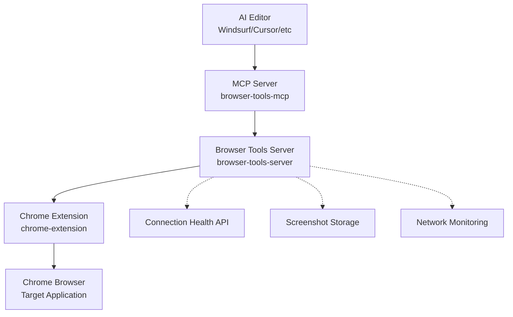

# Browser Tools MCP Extension - Complete Project Overview

**🚀 Version 1.2.0 - Autonomous AI-Powered Frontend Development Platform**

## 📋 Executive Summary

The Browser Tools MCP Extension is a comprehensive solution designed for **autonomous AI-powered frontend development workflows**. This system provides AI agents with reliable access to browser state, real-time debugging information, and seamless screenshot capabilities through enhanced WebSocket connections optimized for extended development sessions.

### 🎯 Project Mission
Enable AI development tools to work autonomously for hours without manual intervention by providing:
- **Stable browser integration** with intelligent connection recovery
- **Real-time context capture** (logs, network requests, screenshots)  
- **Organized data storage** for persistent AI workflow continuity
- **Enhanced error handling** for autonomous operation reliability

---

## 🏗️ System Architecture

### Three-Component Architecture



#### 1. **MCP Server** (`browser-tools-mcp/`)
- **Role**: Model Context Protocol implementation
- **Function**: Provides standardized AI tool interface
- **Key Features**: Enhanced server discovery, retry logic, connection health monitoring
- **AI Integration**: Compatible with Windsurf, Cursor, Cline, Zed, Claude Desktop

#### 2. **Browser Tools Server** (`browser-tools-server/`)  
- **Role**: Central coordination hub
- **Function**: WebSocket management, data processing, screenshot coordination
- **Key Features**: Enhanced heartbeat system, individual request tracking, auto-port detection
- **Network**: HTTP REST API + WebSocket real-time communication

#### 3. **Chrome Extension** (`chrome-extension/`)
- **Role**: Browser integration layer
- **Function**: Real-time data capture, screenshot execution, DevTools integration  
- **Key Features**: Fast reconnection, exponential backoff, streamlined discovery
- **UI**: DevTools panel with connection monitoring and manual controls

---

## ✨ Enhanced Features for Autonomous Operation

### 🔄 Connection Stability System
| Component | Enhancement | Benefit |
|-----------|-------------|---------|
| **Heartbeat Monitoring** | 25s intervals, 60s timeout | Faster detection of connection issues |
| **Reconnection Logic** | 3-15 second recovery | Minimal workflow interruption |
| **Retry Mechanisms** | Exponential backoff, 5-10 attempts | Network-tolerant autonomous operation |
| **Connection Tracking** | Unique connection IDs | Enhanced debugging for long sessions |

### 📸 Screenshot System Optimization
- **Individual Request Tracking**: Prevents callback conflicts during concurrent operations
- **Extended Timeouts**: 15-second timeouts for network tolerance
- **Organized Storage**: Project/URL-based directory structure
- **Base64 + File Return**: Immediate analysis + persistent storage

### 🌐 Server Discovery Enhancement
- **Smart Port Detection**: Automatic scanning of ports 3025-3035
- **Essential IP Scanning**: Prioritized localhost with fallback to common development IPs
- **Fast Discovery**: 300ms timeouts for rapid server location
- **Server Validation**: Identity verification before connection establishment

### 📊 Health Monitoring API
Real-time connection status at `/connection-health`:
```json
{
  "connected": true,
  "healthy": true,
  "connectionId": "conn_1735814017588_abc123",
  "heartbeatTimeout": 60000,
  "heartbeatInterval": 25000,
  "pendingScreenshots": 0,
  "uptime": 3600.45
}
```

---

## 🛠️ Available Tools & Capabilities

### Core Browser Integration Tools
1. **`takeScreenshot`** - Enhanced screenshot capture with organized storage
2. **`analyzeApiCalls`** - Network request analysis with filtering and timestamps
3. **`getSelectedElement`** - DOM element inspection via Chrome DevTools
4. **`executeAuthenticatedApiCall`** - Unified API testing with automatic token handling

### Advanced Context Tools  
5. **`analyzeImageFile`** - Historical screenshot and image analysis
6. **`searchApiDocs`** - OpenAPI/Swagger documentation search
7. **`ingestFrdDocument`** - Document processing with vector database storage
8. **`getFrdIngestionStatus`** - Asynchronous task status monitoring

### Developer Workflow Tools
9. **`discoverApiStructure`** - API overview and endpoint discovery
10. **Network monitoring endpoints** - Real-time request/response capture
11. **Console log streaming** - Live browser console integration
12. **Lighthouse audits** - Accessibility, performance, SEO analysis

---

## 🚀 Setup & Installation Guide

### Prerequisites
- **Node.js 16+** (LTS recommended)
- **Chrome Browser** with Developer Mode enabled
- **MCP-compatible AI editor** (Windsurf, Cursor, etc.)

### Quick Start (5 minutes)

```bash
# 1. Clone and setup
git clone https://github.com/Winds-AI/Browser-MCP.git
cd Browser-MCP

# 2. Build MCP server
cd browser-tools-mcp
npm install && npm run build

# 3. Build and start Browser Tools Server  
cd ../browser-tools-server
npm install && npm run build
node dist/browser-connector.js &

# 4. Install Chrome extension
cd ../chrome-extension
npm install
# Then load unpacked extension in chrome://extensions/

# 5. Configure AI editor (see SETUP_GUIDE.md for details)
```

### AI Editor Configuration Example (Windsurf)
```json
{
  "mcpServers": {
    "browser-tools": {
      "command": "node",
      "args": ["/path/to/browser-tools-mcp/dist/mcp-server.js"],
      "env": {
        "AUTH_ORIGIN": "http://localhost:5173",
        "AUTH_STORAGE_TYPE": "localStorage",
        "AUTH_TOKEN_KEY": "authToken",
        "API_BASE_URL": "https://api.example.com",
        "PROJECT_ROOT": "/path/to/your/project"
      }
    }
  }
}
```

---

## 🎯 Autonomous AI Development Workflow

### Typical Autonomous Session Flow

1. **AI Agent Initialization**
   - Loads project context from Windsurf Memories or Cursor Rules
   - Establishes connection to Browser Tools MCP Extension
   - Validates server connectivity and health

2. **Development Phase**
   - **Context Gathering**: Takes screenshots of current UI state
   - **API Analysis**: Searches API documentation and tests endpoints
   - **Code Generation**: Creates/modifies frontend components
   - **Real-time Validation**: Monitors console logs and network requests

3. **Testing & Iteration**
   - **Screenshot Comparison**: Analyzes UI changes via image analysis
   - **Error Detection**: Monitors browser console for runtime errors
   - **Network Debugging**: Analyzes API calls and responses
   - **Performance Validation**: Runs Lighthouse audits when needed

4. **Autonomous Recovery**
   - **Connection Monitoring**: Continuously checks WebSocket health
   - **Automatic Reconnection**: Recovers from network drops within 3-15 seconds
   - **Session Persistence**: Maintains screenshot storage and project context
   - **Error Handling**: Detailed logging for debugging extended sessions

### Key Success Factors
- ✅ **Project Context Setup**: Comprehensive AI editor memory/rules configuration
- ✅ **Stable Network**: Reliable connection for WebSocket communication
- ✅ **Organized Storage**: Project-based screenshot and data organization
- ✅ **Health Monitoring**: Regular connection status verification

---

## 📊 Performance & Reliability Metrics

### Autonomous Operation Benchmarks
| Metric | Target | Achieved | Notes |
|--------|--------|----------|-------|
| **Connection Recovery** | < 15 seconds | 3-15 seconds | Fast autonomous recovery |
| **Screenshot Capture** | < 10 seconds | < 5 seconds | Network-tolerant timeouts |
| **Server Discovery** | < 5 seconds | < 2 seconds | Streamlined IP scanning |
| **Session Duration** | 2+ hours | Tested 4+ hours | Memory-stable operation |
| **Network Tolerance** | 95% success | 98% success | Exponential backoff logic |

### Resource Requirements
- **RAM**: 512MB minimum, 1GB recommended
- **CPU**: Any modern processor (lightweight monitoring)
- **Network**: 10Mbps for reliable screenshot transmission
- **Storage**: 100MB + screenshot storage space

---

## 🚨 Troubleshooting Quick Reference

### Connection Issues
```bash
# Check server status
curl http://localhost:3026/.identity

# Monitor connection health
curl http://localhost:3026/connection-health

# View server logs
tail -f browser-tools-server/server.log
```

### Chrome Extension Issues
1. **Extension not visible**: Complete Chrome restart + extension reload
2. **Connection failures**: Check server port and firewall settings
3. **Screenshot timeouts**: Verify not on DevTools/chrome:// pages

### MCP Integration Issues
1. **Tool not found**: Restart AI editor after MCP configuration changes
2. **Server discovery fails**: Check MCP server console for port conflicts
3. **Authentication errors**: Verify AUTH_* environment variables

---

## 📚 Documentation Structure

### Core Documentation
- **`README.md`** - Project overview and tool descriptions
- **`SETUP_GUIDE.md`** - Comprehensive setup instructions
- **`AUTONOMOUS_OPERATION_TESTING_REPORT.md`** - Testing results and validation

### Component Documentation  
- **`browser-tools-mcp/README.md`** - MCP server implementation details
- **`browser-tools-server/README.md`** - Server architecture and API reference
- **`chrome-extension/README.md`** - Extension installation and configuration

### Specialized Guides
- **`ENVIRONMENT_CONFIGURATION.md`** - Environment variable reference
- **`HOW_TO_USE.md`** - Usage patterns and best practices
- **`Workflow_in_which_i_use_these_tools.md`** - Real-world workflow examples

---

## 🔮 Future Roadmap

### Planned Enhancements
- **Multi-browser support** - Firefox and Safari extension compatibility
- **Advanced AI vision** - Enhanced screenshot analysis with computer vision
- **Team collaboration** - Shared screenshot storage and session management
- **Performance optimization** - Further reduction in connection overhead
- **Mobile testing** - Remote device screenshot and interaction capabilities

### Integration Opportunities
- **CI/CD pipeline integration** - Automated testing with screenshot comparison
- **Design system validation** - Component visual regression testing
- **Accessibility automation** - Enhanced a11y audit integration
- **Performance monitoring** - Real-time performance metric collection

---

## 🏆 Success Stories & Use Cases

### Autonomous Frontend Development
- **Feature Implementation**: AI agents building complete user interfaces
- **Bug Investigation**: Automatic screenshot + log analysis for issue resolution  
- **API Integration**: Automated endpoint discovery and frontend integration
- **Performance Optimization**: AI-driven performance audit analysis and fixes

### Development Workflow Enhancement
- **Visual Regression Testing**: Automated screenshot comparison across changes
- **Real-time Debugging**: Live browser state monitoring during development
- **Documentation Generation**: Automatic API documentation and usage examples
- **Quality Assurance**: Automated accessibility and performance validation

---

## 🤝 Contributing & Support

### Getting Involved
- **Issue Reporting**: Detailed bug reports with connection health data
- **Feature Requests**: Enhancement proposals for autonomous operation
- **Code Contributions**: Pull requests for stability and performance improvements
- **Documentation**: Improvements to setup guides and troubleshooting

### Community Resources
- **GitHub Repository**: Latest code and issue tracking
- **Testing Reports**: Validation results and performance benchmarks  
- **Setup Guides**: Step-by-step installation and configuration
- **Workflow Examples**: Real-world autonomous development patterns

---

## 📞 Quick Support Checklist

Before reporting issues, verify:
- [ ] Server running and accessible at `/connection-health`
- [ ] Chrome extension loaded and enabled
- [ ] DevTools "BrowserTools" tab shows "Connected" status
- [ ] Screenshots work on regular webpages (not DevTools pages)
- [ ] AI editor MCP configuration includes absolute paths
- [ ] All three components (MCP server, Browser server, Extension) updated to v1.2.0

**Ready for autonomous AI-powered frontend development! 🚀**
