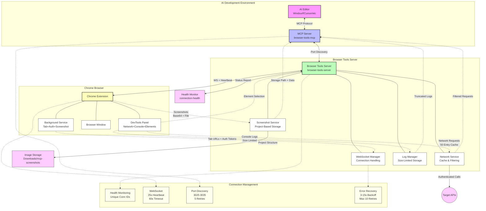

# Browser Tools MCP Extension - Complete Project Overview

**🚀 Version 1.2.0 - Autonomous AI-Powered Frontend Development Platform**

## 📋 Executive Summary

The Browser Tools MCP Extension is a comprehensive solution designed for **autonomous AI-powered frontend development workflows**. This system provides AI agents with reliable access to browser state, real-time debugging information, and seamless screenshot capabilities through enhanced WebSocket connections optimized for extended development sessions.

### 🎯 Project Mission
Enable AI development tools to work autonomously for hours without manual intervention by providing:
- **Stable browser integration** with intelligent connection recovery
- **Real-time context capture** (logs, network requests, screenshots)  
- **Organized data storage** for persistent AI workflow continuity
- **Enhanced error handling** for autonomous operation reliability

---

## 🏗️ System Architecture

### Three-Component Architecture



#### 1. **MCP Server** (`browser-tools-mcp/`)
- **Role**: Model Context Protocol implementation
- **Function**: Provides standardized AI tool interface
- **Key Features**: Enhanced server discovery, retry logic, connection health monitoring
- **AI Integration**: Compatible with Windsurf, Cursor, Cline, Zed, Claude Desktop

#### 2. **Browser Tools Server** (`browser-tools-server/`)  
- **Role**: Central coordination hub
- **Function**: WebSocket management, data processing, screenshot coordination
- **Key Features**: Enhanced heartbeat system, individual request tracking, auto-port detection
- **Network**: HTTP REST API + WebSocket real-time communication

#### 3. **Chrome Extension** (`chrome-extension/`)
- **Role**: Browser integration layer
- **Function**: Real-time data capture, screenshot execution, DevTools integration  
- **Key Features**: Fast reconnection, exponential backoff, streamlined discovery
- **UI**: DevTools panel with connection monitoring and manual controls

---

## ✨ Enhanced Features for Autonomous Operation

### 🔄 Connection Stability System
| Component | Enhancement | Benefit |
|-----------|-------------|---------|
| **Heartbeat Monitoring** | 25s intervals, 60s timeout | Faster detection of connection issues |
| **Reconnection Logic** | 3-15 second recovery | Minimal workflow interruption |
| **Retry Mechanisms** | Exponential backoff, 5-10 attempts | Network-tolerant autonomous operation |
| **Connection Tracking** | Unique connection IDs | Enhanced debugging for long sessions |

### 📸 Screenshot System Optimization
- **Individual Request Tracking**: Prevents callback conflicts during concurrent operations
- **Extended Timeouts**: 15-second timeouts for network tolerance
- **Organized Storage**: Project/URL-based directory structure
- **Base64 + File Return**: Immediate analysis + persistent storage

### 🌐 Server Discovery Enhancement
- **Smart Port Detection**: Automatic scanning of ports 3025-3035
- **Essential IP Scanning**: Prioritized localhost with fallback to common development IPs
- **Fast Discovery**: 300ms timeouts for rapid server location
- **Server Validation**: Identity verification before connection establishment

### 📊 Health Monitoring API
Real-time connection status at `/connection-health`:
```json
{
  "connected": true,
  "healthy": true,
  "connectionId": "conn_1735814017588_abc123",
  "heartbeatTimeout": 60000,
  "heartbeatInterval": 25000,
  "pendingScreenshots": 0,
  "uptime": 3600.45
}
```


## Available Tools

The following tools are available through the Browser Tools MCP server:

1.  **`analyzeApiCalls`**
    *   **Description**: Analyzes API interactions between the frontend and backend by retrieving filtered network request details. This tool is useful for inspecting API calls to specific endpoints, debugging network errors and status codes, examining request/response payloads, investigating authentication headers, or monitoring AJAX requests. Results include timestamps to help distinguish between identical API calls made at different times.
    *   **Parameters**:
        *   `urlFilter` (string, required): A substring or pattern to filter request URLs.
        *   `details` (array of strings, required): Specific details to retrieve for each request. Possible values include: `"url"`, `"method"`, `"status"`, `"timestamp"`, `"requestHeaders"`, `"responseHeaders"`, `"requestBody"`, `"responseBody"`.
        *   `timeStart` (number, optional): A Unix timestamp (in milliseconds) to filter requests that occurred after this time.
        *   `timeEnd` (number, optional): A Unix timestamp (in milliseconds) to filter requests that occurred before this time.
        *   `orderBy` (string, optional, default: `"timestamp"`): The field to order results by. Possible values: `"timestamp"`, `"url"`.
        *   `orderDirection` (string, optional, default: `"desc"`): The direction for ordering. Possible values: `"asc"` (oldest first), `"desc"` (newest first).
        *   `limit` (number, optional, default: `20`): The maximum number of results to return.
    *   **Functionality**: This tool constructs a query based on the provided parameters and fetches network request details from the `browser-connector` server (typically at `http://<host>:<port>/network-request-details`). It then returns the filtered and ordered list of network interactions.

2.  **`takeScreenshot`** ⭐ **ENHANCED**
    *   **Description**: Take a screenshot of the current browser tab and return the image data for immediate analysis. The screenshot is automatically organized by project and URL structure in a centralized directory system.
    *   **Parameters**: 
        *   `filename` (string, optional): Optional custom filename for the screenshot (without extension). If not provided, uses timestamp-based naming.
        *   `returnImageData` (boolean, optional, default: true): Whether to return the base64 image data in the response for immediate analysis.
        *   `projectName` (string, optional): Optional project name to override automatic project detection. Screenshots will be organized under this project folder.
    *   **Functionality**: Captures a screenshot via the Chrome extension with enhanced connection stability. Features 15-second timeout for autonomous operation reliability and organized storage system. Returns both file confirmation and base64 image data (if requested) for immediate analysis workflows.

3.  **`getSelectedElement`**
    *   **Description**: Retrieves information about the HTML element currently selected by the user in the browser's DevTools (if any).
    *   **Parameters**: None.
    *   **Functionality**: This tool queries the `browser-connector` server (at `http://<host>:<port>/selected-element`) to get details of the element last inspected or selected by the user in the Chrome DevTools. It returns a JSON string containing information about the selected element.

4.  **`analyzeImageFile`**
    *   **Description**: Load and analyze previously saved images or existing image files. Use this to access historical screenshots taken with takeScreenshot or any other image files in your project.
    *   **Parameters**:
        *   `imagePath` (string, required): The path to the image file. This can be an absolute path or a path relative to the project root.
        *   `projectRoot` (string, optional): An optional path to override the default project root directory. If not provided, it uses the `PROJECT_ROOT` environment variable or the directory of the MCP server.
    *   **Functionality**: The tool resolves the absolute path to the image, reads the file, converts its content to a base64 string, and determines its MIME type. It returns an object containing the `fileName`, `mimeType`, `size` (in bytes), and the `base64Data` of the image.

5.  **`searchApiDocs`**
    *   **Description**: Searches through an OpenAPI (Swagger) specification to find API endpoints that match a given pattern. This helps in understanding API structures, parameters, and responses.
    *   **Parameters**:
        *   `swaggerSource` (string, required): The source of the Swagger/OpenAPI specification. This can be a URL, a local file path, or a JSON string containing the specification. Defaults to the `SWAGGER_URL` environment variable if not provided.
        *   `apiPattern` (string, required): A regular expression pattern to match against API paths or `operationId`s.
        *   `includeSchemas` (boolean, optional, default: `true`): If true, the tool will attempt to resolve and include the full schema definitions for parameters, request bodies, and responses referenced via `$ref`.
    *   **Functionality**:
        *   Loads the OpenAPI specification from the `swaggerSource`.
        *   Iterates through all defined paths and operations in the specification.
        *   Matches the `apiPattern` against the endpoint path and its `operationId`.
        *   For matching endpoints, it extracts details like the HTTP method, summary, description, parameters, request body, and responses.
        *   If `includeSchemas` is true, it resolves and embeds any referenced JSON schemas directly into the output for the matching endpoints.

6.  **`executeAuthenticatedApiCall`** *(NEW - Unified API Testing Tool)*
    *   **Description**: Automatically retrieves authentication tokens from browser session and executes authenticated API calls. This eliminates token retrieval hallucination and ensures consistent API testing with real authentication.
    *   **Parameters**:
        *   `endpoint` (string, required): The API endpoint path (e.g., '/api/users', '/auth/profile'). Combined with API_BASE_URL from environment.
        *   `method` (enum, optional, default: "GET"): HTTP method for the API call (GET, POST, PUT, PATCH, DELETE).
        *   `requestBody` (any, optional): Request body for POST/PUT/PATCH requests (automatically JSON stringified).
        *   `queryParams` (object, optional): Query parameters as key-value pairs.
        *   `additionalHeaders` (object, optional): Additional headers to include in the request.
        *   `includeResponseDetails` (boolean, optional, default: true): Whether to include detailed response analysis (status, headers, timing).
    *   **Environment Variables Required**:
        *   `AUTH_ORIGIN`: The origin where your app is running (e.g., "http://localhost:5173")
        *   `AUTH_STORAGE_TYPE`: Where the auth token is stored ("cookie", "localStorage", or "sessionStorage")
        *   `AUTH_TOKEN_KEY`: The key name for the auth token (e.g., "authToken", "accessToken")
        *   `API_BASE_URL`: Your API base URL (e.g., "https://api.example.com")
    *   **Functionality**:
        *   Automatically retrieves auth token from browser session using predefined environment configuration
        *   Constructs full API URL and adds query parameters if provided
        *   Makes authenticated API request with proper Authorization header
        *   Returns structured response with actual API data and optional detailed metrics
        *   Eliminates manual token handling and curl command execution
