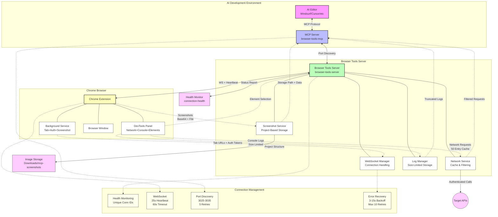

# Browser Tools MCP Extension - Complete Project Overview

**🚀 Version 1.2.0 - Autonomous AI-Powered Frontend Development Platform**

## 📋 Executive Summary

The Browser Tools MCP Extension is a comprehensive solution designed for **autonomous AI-powered frontend development workflows**. This system provides AI agents with reliable access to browser state, real-time debugging information, and seamless screenshot capabilities through enhanced WebSocket connections optimized for extended development sessions.

### 🎯 Project Mission
Enable AI development tools to work autonomously for hours without manual intervention by providing:
- **Stable browser integration** with intelligent connection recovery
- **Real-time context capture** (logs, network requests, screenshots)  
- **Organized data storage** for persistent AI workflow continuity
- **Enhanced error handling** for autonomous operation reliability

---

## 🏗️ System Architecture

### Three-Component Architecture



#### 1. **MCP Server** (`browser-tools-mcp/`)
- **Role**: Model Context Protocol implementation
- **Function**: Provides standardized AI tool interface
- **Key Features**: Enhanced server discovery, retry logic, connection health monitoring
- **AI Integration**: Compatible with Windsurf, Cursor, Cline, Zed, Claude Desktop

#### 2. **Browser Tools Server** (`browser-tools-server/`)  
- **Role**: Central coordination hub
- **Function**: WebSocket management, data processing, screenshot coordination
- **Key Features**: Enhanced heartbeat system, individual request tracking, auto-port detection
- **Network**: HTTP REST API + WebSocket real-time communication

#### 3. **Chrome Extension** (`chrome-extension/`)
- **Role**: Browser integration layer
- **Function**: Real-time data capture, screenshot execution, DevTools integration  
- **Key Features**: Fast reconnection, exponential backoff, streamlined discovery
- **UI**: DevTools panel with connection monitoring and manual controls

---

## ✨ Enhanced Features for Autonomous Operation

### 🔄 Connection Stability System
| Component | Enhancement | Benefit |
|-----------|-------------|---------|
| **Heartbeat Monitoring** | 25s intervals, 60s timeout | Faster detection of connection issues |
| **Reconnection Logic** | 3-15 second recovery | Minimal workflow interruption |
| **Retry Mechanisms** | Exponential backoff, 5-10 attempts | Network-tolerant autonomous operation |
| **Connection Tracking** | Unique connection IDs | Enhanced debugging for long sessions |

### 📸 Screenshot System Optimization
- **Individual Request Tracking**: Prevents callback conflicts during concurrent operations
- **Extended Timeouts**: 15-second timeouts for network tolerance
- **Organized Storage**: Project/URL-based directory structure
- **Base64 + File Return**: Immediate analysis + persistent storage

### 🌐 Server Discovery Enhancement
- **Smart Port Detection**: Automatic scanning of ports 3025-3035
- **Essential IP Scanning**: Prioritized localhost with fallback to common development IPs
- **Fast Discovery**: 300ms timeouts for rapid server location
- **Server Validation**: Identity verification before connection establishment

### 📊 Health Monitoring API
Real-time connection status at `/connection-health`:
```json
{
  "connected": true,
  "healthy": true,
  "connectionId": "conn_1735814017588_abc123",
  "heartbeatTimeout": 60000,
  "heartbeatInterval": 25000,
  "pendingScreenshots": 0,
  "uptime": 3600.45
}
```